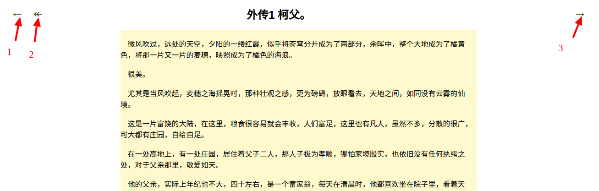

# 小说web端服务器

## 项目简介
   此项目是为展示小说信息的web服务端。可以调用由python爬虫框架scrapy编写的爬虫项目，以爬取小说信息。
    
## 项目截图
   一、首页
   
   
   
   二、小说目录页
   
   
   
   &emsp;功能1：返回小说列表  
   &emsp;功能2：逆序显示  
   &emsp;功能3：运行爬虫服务端更新小说数据，爬虫服务器地址：[https://github.com/xiaoben67/novel](https://github.com/xiaoben67/novel)
   
   三、小说章节页
   
   
    
   &emsp;功能1：上一篇  
   &emsp;功能2：返回目录  
   &emsp;功能3：下一篇  
    
## 项目环境
   项目是基于maven工具构建，使用springmvc4+hibernate4框架，数据库为mysql5.7，系统为Ubuntu16.10    
   
   使用IDEA构建项目：首先Fork项目，然后运行File --> New --> Project from Version Control --> GitHub
   
## 项目运行方法
   一、下载爬虫项目：此项目使用python2.7的scrapy爬虫框架编写（建议使用"piaotian"分支）
    
   &emsp;1. git clone https://github.com/xiaoben67/novel.git  
   &emsp;2. cd novel  
   &emsp;3. git checkout piaotian  
   &emsp;4. 项目的script有数据库sql文件，需要初始化。具体使用可查看：[https://github.com/xiaoben67/novel/blob/piaotian/README.md](https://github.com/xiaoben67/novel/blob/piaotian/README.md)
     
   二、修改本项目（novelserver）下执行爬虫的脚本  
   
   &emsp;novelserver/src/main/java/com/hjj/ben/script/start_crawl.sh
     
   
